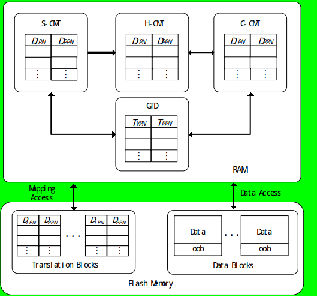
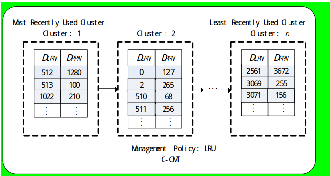

# CFTL
## 运行代码需要注意的地方
### 编译环境
代码是直接运行在Ubuntu10.04的机子上,gcc-2.95,在实验室的那台老机子上,我已经打包压缩好了,注意使用前备份
### 代码替换注意项
注意本代码不能直接独立编译运行!!!!只是Flashsim修改后的代码
Flashsim的代码必须编译运行在disksim3.0的仿真器上,因此必须先安装成功disksim+flashsim的仿真器后,将主目录下的src换成该CFTL的文件(注意改名为src),重新在主目录下make,编译成功后,进入test.release目录下进行配置操作运行
### 代码修改运行注意事项
采用git,在自己的电脑进行修改,之后push在老电脑上push同步直接运行编译查看错误修改,建议多了解ssh使用和git使用操作


## 算法的基本原理说明

### CFTL的FTL策略
在SLC采用循环队列策略
在MLC采用的是(师兄对比仿真采用了SDFTL,而原文采用BAST的混合地址映射的方式)
所有的代码SLC和MLC的读写操作都被师兄封装在了dftl.c中
SDFTL的代码逻辑在ssd_interface.c的callFsim中实现

### CFTL的数据分配机制
CFTL的数据分配机制根据负载的请求大小来进行热数据识别,并采用2均值聚类算法来自适应调整阈值大小,具体实现操作如下(十分简单):
	令C[]为一个一位数组,c[i]表示所有请求中2的i次幂个sector大小的请求的数量,其中接受到的请求最大为1024sector,因此算法中只需要11个计数器即可统计出2的0次幂到2的10次幂返回内写请求的大小的分布情况,注意是针对**写请求的**,注意**对于大小不是2的幂次方的写请求,其大小按照最接近的2的幂次方的值来处理**.下面就是2均值聚类的操作,随机选择两个值作为聚类的中心点,bababala,就是那老套路
    CFTL聚类后会有一个大的j和小的i的类中心.小的i就是判断阈值,小于i的请求都认为是热的,直接写入到SLC区域,大于i的直接写入到MLC区域.

### CFTL的数据迁移机制
CFTL将SLC区域当做循环队列使用,闪存块会按照物理块地址次序一次排列,第一块和最后一个块首位相互链接,如图所示:


head指向最新的空闲块,tail指向垃圾回收的目标块.初始状态,head和tail指针指向同一个位置,新来的数据写入到head指针指向的块,每当一个空闲块写满后,head指针前移.当SLC的空余块少于一定量的时候,启动垃圾回收机制,回收tail指针指向的块,然后将tail指针前移.任何一个指针超过最后一个物理块的时候,都将该指针指向第一个物理块.通过这种方式,在tail指针指向的物理块的有效数据更新频率更低,因此将tail指针指向的物理块被擦除前,直接将该块中的有效数据迁移到MLC区域中去.


# FTL算法相关算法说明

## 采用CFTL层的仿真代码实现
映射缓存DRAM被分为H-CMT，S-CMT，C-CMT，GTD４个部分．数据块区域用于实际的数据存储，转换块区域用于页级映射表的存储．H-CMT用于缓存访问频率较高的请求的映射项；C-CMT用于缓存访问频率低下的请求的映射项，以及当H-CMT满时从H-CMT剔除的、发生更新的映射项；S-CMT用于缓存高空间本地性请求（连续请求）的映射项．GTD的作用与DFTL的类似，用来记录转换块区域中每个页的地址映射项．其设计结构如图所示:

###  CPFTL关键结构
#### HCMT
H-CMT主要是用来缓存访问频繁的请求的映射项．当有请求到来，且请求的映射项在H-CMT中时，就可立即得到服务．当请求不在H-CMT，则到S-CMT 和C-CMT中查询．再者，H-CMT使用LRU策略对每个映射项进行管理．当H-CMT满时，选择最近最少访问的请求的映射项进行剔除．此时，若该映射项已更新，则将其剔除到C-CMT中，反之，则直接从缓存中剔除出去．
#### C-CMT
C-CMT主要用来缓存访问频率低的请求的映射项．一方面**，大小小于或者等于2KB的请求不在缓存中命中(第一次命中)时，都被认为是访问频率低的请求**，直接加载到C-CMT中；**另一方面，C-CMT还存储从H-CMT剔除的、发生更新的映射项．此外，若C-CMT中的映射项被二次访问，同样认为该请求为频繁访问请求**，需要将此映射项加载到H-CMT中．再者，C-CMT采用聚簇的思想，即将属于同一转换页中的映射项进行聚簇，并使用LRU策略对所有的簇进行管理，如图所示:


当C-CMT满后，按簇为单位进行剔除．选择剔除簇时，考虑到：一方面，若仅根据簇的映射项个数选择剔除簇，即选择映射项最多的簇进行剔除，则可能会使访问频率低下的簇对应的映射项长时间滞留在C-CMT中，浪费了宝贵的C-CMT缓存空间；另一方面，若仅根据LRU原则选择剔除簇，即选择最近最少访问的簇进行剔除，则可能造成每次剔除回收的缓存空间有限，从而造成经常的地址转换页访问，即增大地址转换页的读写开销．
**因此，CPFTL在选择剔除簇时，综合考虑簇的映射项个数和簇在LRU队列中的位置．具体来说，当C-CMT满时，先判断具有最多映射项的簇包含的映射项个数是否大于某个阈值，如果是，选择该簇进行剔除；否则，根据LRU原则选择最近最少访问簇进行剔除**
####  S-CMT 
S-CMT主要是用来缓存高空间本地性请求，也即连续请求的映射项．当一个新的请求到来时，**如果请求大小大于2KB，CPFTL便认为该请求具有连续性，进而1次加载1组连续的映射项到S-CMT中**．当请求在S-CMT再次命中后，则认为该请求为频繁访问请求，并把命中的映射项加载到H-CMT中．再者，S-CMT采用先进先出（first in first out，FIFO）的管理策略，即每次选择停留时间最长的1组映射项进行剔除或更新
### CPFTL层的伪代码
#### 主函数逻辑伪代码:
```
算法1.CPFTL.
 Input: request R with logical page number Rlpn, request size Rsize, request type Rtype;
 LPN = Rlpn, Size = Rsize;
 while Size ≠0 do
  if LPN hits H-CMT or S-CMT or C-CMT then
     service the request; 
       if LPN hits in S-CMT or C-CMT again then /*load the hit entry into H-CMT*/
         load the corresponding entry of LPN into H-CMT using 算法 2;
       end
  elseif Size ≤2 KB then /*load the entry into C-CMT*/
     load the corresponding entry of LPN into C-CMT using 算法 3;
     service the request;
  else/*load the entry into S-CMT*/
     load a group of entries into S-CMT using 算法 4;
       if Rtype is read then
         get the PPN by the entry;
       else /*Rtype is write*/
         service the request with new PPN;
       end
  end
  LPN ++;
  Size --;
 end

```
#### 加载频繁的访问项到H-CMT中
```
算法2
 Input: LPN;
 if H-CMT is full then
   select the victim entry according to LRU policy;
   if the victim entry is updated then /*load this entry into C-CMT*/
     update the entries of C-CMT using 算法 3;
   else
     directly discard the entry form H-CMT;
   end
 end
 load the corresponding entry of LPN into H-CMT
```
#### 将H-CMT中淘汰的数据映射项到C-CMT中
```
算法3：C-CMT update.
 Input: LPN;
 if C-CMT is full then
   if entries’number of cluster which owns the maximum entries > Threshold then
     evict this cluster from C-CMT;
   else
     evict the least recently used cluster from C-CMT;
   end
 end
 load the corresponding entry of LPN into C-CMT
```
#### 将判断为连续请求的数据映射项预取到S-CMT中
```
算法4：S-CMT update.
 Input: LPN;
  if S-CMT is full then
   evict a group of entries from the S-CMT according to FIFO policy;
  end
 load the corresponding entry of LPN and the following some entries into S-CMT
```
